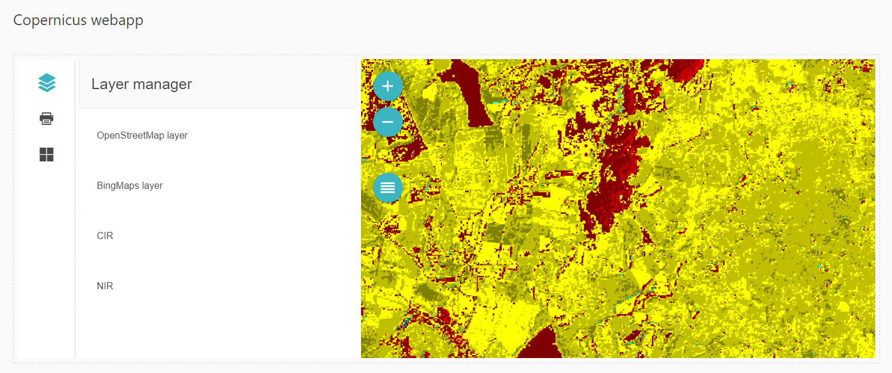

# Copernicus-webapp
> Client-based raster calculations on Copernicus data using the Mangol web mapping framework

## About Coperncus-webapp
Copernicus-webapp is about to quickly visualize some raster calculations that are NOT provided by a GIS server but calculated completely in the browser.

## About Mangol
[Mangol](http://github.com/fegyi001/mangol) is an open source web mapping framework that uses Angular2+ and OpenLayers3.

## Install
[Node.js with npm](https://nodejs.org/en/download/) is required. The preferenced version of Node.js is 6.9.1 LTS, the preferenced version of npm is 4.x.x. After `git clone`, navigate to the main directory and run ```npm install``` to download all dependencies.
You also need angular-cli that should be installed globally like this:
```batch
npm install angular-cli -g
```

## Live example
An online example can be opened [here](http://188.166.116.137/copernicus-webapp).

## Load the app
You simply have to run ```ng serve``` to load the demo page on ```localhost:4200```. With this command you can also watch file changes until you shut it down. 

## Present & Future
At the moment only two sample raster images are loaded from a remote GeoServer, and NDVI index can be calculated from them in the browser. The outcome of the calculation is then added to the map with a default color ramp. If the project becomes successful more options can be added such as creating other indexes and uploading more imagery.



## Author
```Copernicus-webapp``` was created by [Gergely Padányi-Gulyás](http://gpadanyig.com)
